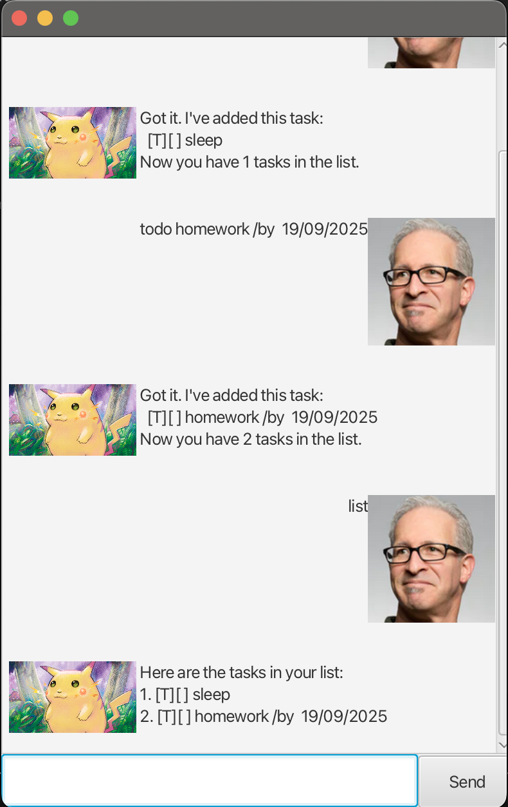

# Rat

> A lightweight JavaFX task assistant that understands natural, chat-style commands. Add todos, deadlines, and events; list, mark, unmark, delete, find, and now snooze tasks without leaving the keyboard.



## Quick Start

Requirements

- Java 17 or later installed locally
- (Optional) Gradle — the project includes a wrapper so `./gradlew` works out of the box

**Run**

```bash
./gradlew run
```

Rat opens in a JavaFX window. All tasks are persisted automatically to `./data/Rat.txt` after each change.

## Command Summary

| Command      | Format                                                                | Description                                            |
| ------------ | --------------------------------------------------------------------- | ------------------------------------------------------ |
| `todo`       | `todo DESCRIPTION`                                                     | Adds a todo task.                                      |
| `deadline`   | `deadline DESCRIPTION /by WHEN`                                        | Adds a deadline; supports flexible date/time formats.  |
| `event`      | `event DESCRIPTION /from START /to END`                                | Adds an event with start and end times.                |
| `list`       | `list`                                                                 | Shows all tasks with 1-based indexes.                  |
| `mark`       | `mark INDEX`                                                           | Marks the task at `INDEX` as done.                     |
| `unmark`     | `unmark INDEX`                                                         | Marks the task at `INDEX` as not done.                 |
| `delete`     | `delete INDEX`                                                         | Removes the task at `INDEX`.                           |
| `find`       | `find KEYWORD`                                                         | Lists tasks whose description contains `KEYWORD`.      |
| `find /on`   | `find /on yyyy-MM-dd`                                                  | Shows deadlines/events occurring on the specific date. |
| `snooze`     | `snooze INDEX /by NEW_TIME`<br>`snooze INDEX /from NEW_START /to NEW_END` | Reschedules a deadline or event.                       |
| `bye`        | `bye`                                                                  | Exits the application.                                 |

> Indexes shown by `list` are 1-based. Commands are case-insensitive.

## Adding Tasks

### Todos

```
todo finish homework
```

```
Got it. I've added this task:
  [T][ ] finish homework
Now you have 1 task in the list.
```

### Deadlines

```
deadline Submit report /by 2024-10-05 1800
```

```
Got it. I've added this task:
  [D][ ] Submit report (by: Oct 05 2024 06:00 PM)
Now you have 2 tasks in the list.
```

Accepted date/time formats include `yyyy-MM-dd`, `yyyy-MM-dd HHmm`, `dd/MM/yyyy HHmm`, and ISO strings like `2024-10-05T18:00`.

### Events

```
event Team sync /from 2024-10-05 1400 /to 2024-10-05 1530
```

```
Got it. I've added this task:
  [E][ ] Team sync (from: Oct 05 2024 02:00 PM to: Oct 05 2024 03:30 PM)
Now you have 3 tasks in the list.
```

## Snoozing Tasks

Use `snooze` to reschedule deadlines and events without recreating them.

Deadline example:

```
snooze 2 /by 2024-10-06 0900
```

Event example:

```
snooze 3 /from 2024-10-06 1400 /to 2024-10-06 1600
```

Both commands update the existing task and immediately persist the change.

## Listing and Filtering

### List

```
list
```

```
 Here are the tasks in your list:
 1. [T][ ] finish homework
 2. [D][ ] Submit report (by: Oct 05 2024 06:00 PM)
 3. [E][ ] Team sync (from: Oct 05 2024 02:00 PM to: Oct 05 2024 03:30 PM)
```

### Find by Keyword

```
find report
```

```
 Here are the matching tasks in your list:
 1. [D][ ] Submit report (by: Oct 05 2024 06:00 PM)
```

### Find by Date

```
find /on 2024-10-05
```

```
 Here are the tasks on Oct 05 2024:
 1. [D][ ] Submit report (by: Oct 05 2024 06:00 PM)
 2. [E][ ] Team sync (from: Oct 05 2024 02:00 PM to: Oct 05 2024 03:30 PM)
```

## Managing Task Status

```
mark 1
```

```
 Nice! I've marked this task as done:
   [T][X] finish homework
```

```
unmark 1
```

```
 OK, I've marked this task as not done yet:
   [T][ ] finish homework
```

## Deleting Tasks

```
delete 1
```

```
 Noted. I've removed this task:
   [T][ ] finish homework
 Now you have 2 tasks in the list.
```

## Exiting

```
bye
```

Rat will print a farewell message and close the window.

---

Need help or found a bug? Open an issue on the project repository and include the command sequence that reproduces it.
